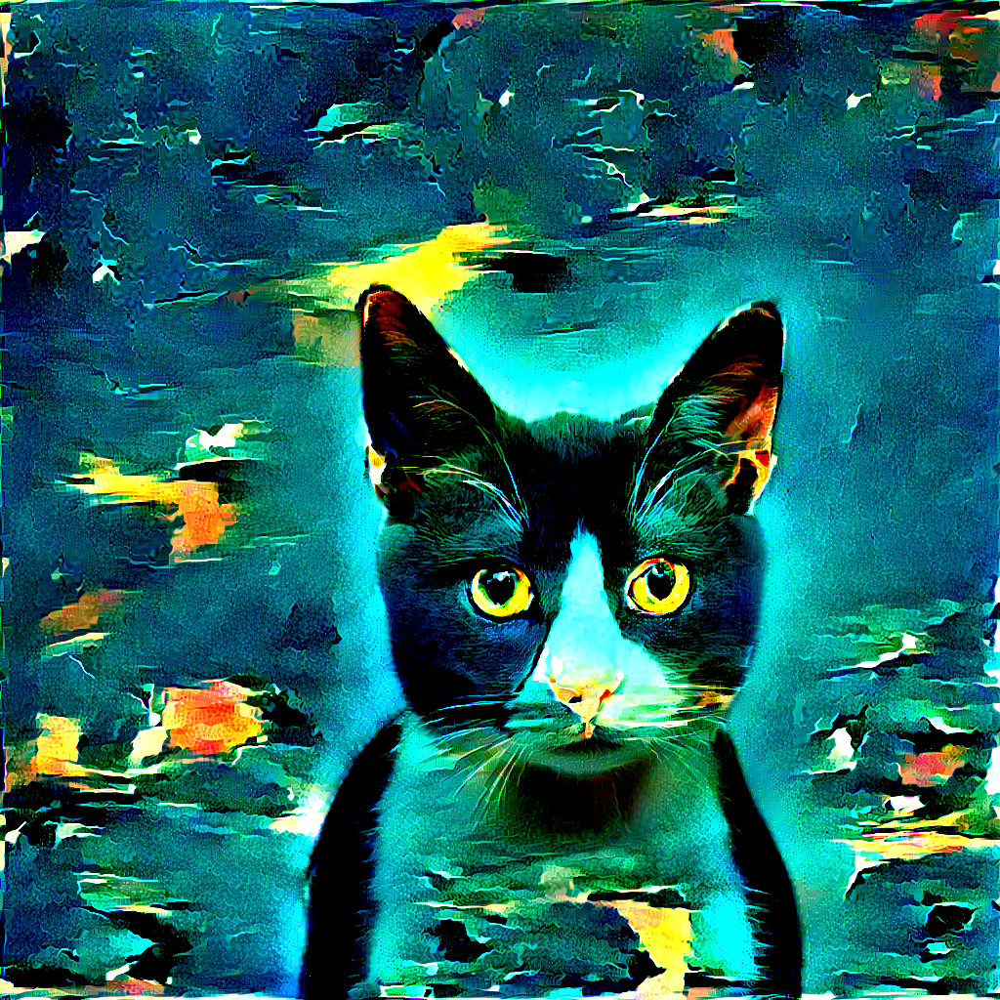
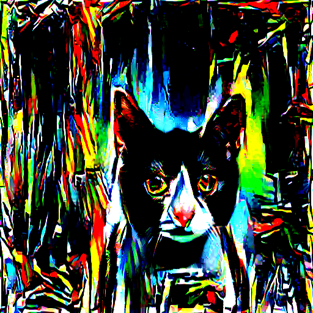
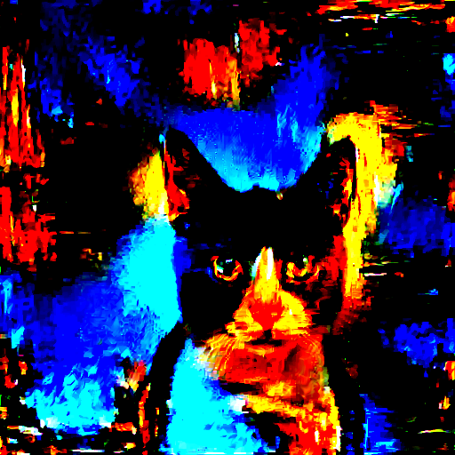
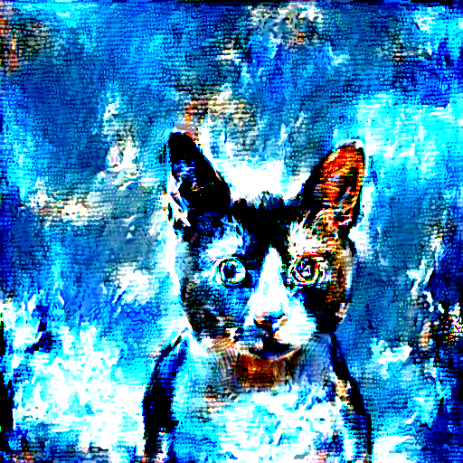

# NeuralStyleTransfer
Breaking Down Gatys' Neural Style Transfer Algorithm

<a href="https://medium.com/@stepanulyanin/breaking-down-leon-gatys-neural-style-transfer-in-pytorch-faf9f0eb79db?source=friends_link&sk=cb5aec47acc8e396c61d82dbd02f943e">Medium Article</a>

### How to run

Create the conda environment by running `conda env create -f reqs.yml`

Note that GPU is highly recommended to train the model. Also, remember to weight your content, style and variance losses
according to desired results.

Train the model by running `python nst.py --style_imge --content_image --img_dim --num_iter --style_loss_weight
 --content_loss_weight --variation_loss_weight --print_every --save_every` by setting the flags.
 
### Some Results

 
